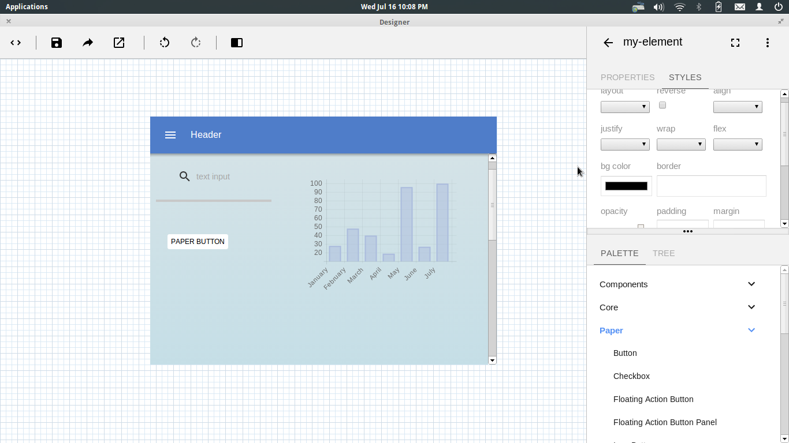

# Polymer Builder
===============

Desktop version of polymer-designer via atom-shell https://github.com/polymer/designer

This is a simple try for atom-shell, which integrates with existing web project.

With some modifications, I have following:

Go releases page to download app.
